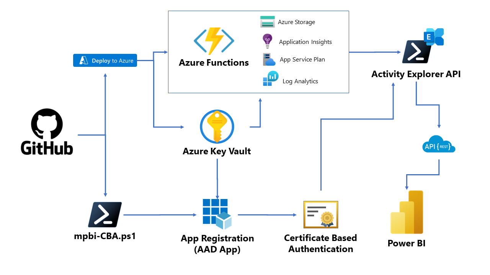
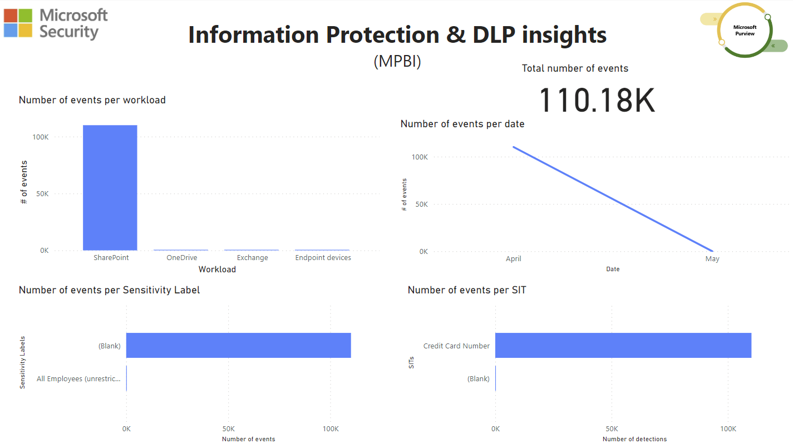
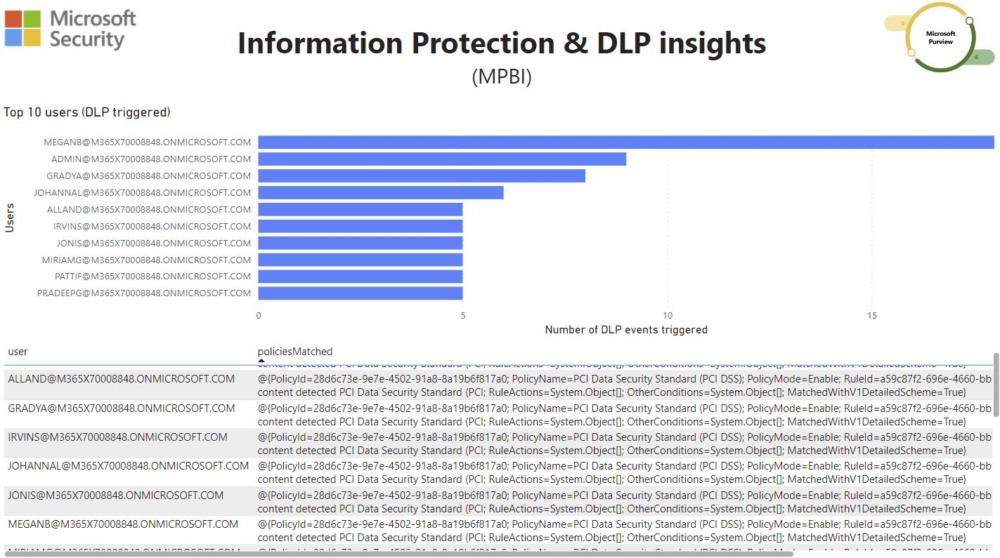

# Microsoft Purview Business Intelligence (MPBI)

Welcome to the **Microsoft Purview Business Intelligence** repository! This solution is designed to export data from the Microsoft Purview Activity Data Explorer using a REST API. It leverages Azure Functions with a PowerShell 7.2 runtime, Azure Table storage (using the Azure Storage account created by the Azure Function deployment), Azure Key Vault for managing the CBA authentication to the PowerShell module, and an Azure AD App Registration. The entire deployment process is simplified with a "Deploy to Azure" button, which automatically deploys all resources using an ARM template compiled from a Bicep file.


This README will guide you through the functionalities of the tool and provide instructions for a quick and successful deployment. By the end of this guide, you'll have a better understanding of how to use this solution to efficiently manage and export your activity data from Microsoft Purview. Let's get started!

***Disclaimer**: Please note that this solution is created by David Muñoz (Technology Consultant at Microsoft), but it is not an official Microsoft tool. The solution is provided "as is" without any warranties, expressed or implied. Use at your own risk.*

___

## **Table of Contents**

- [Deployment](#deployment)
- [Solution Overview](#solution-overview)
- [Usage](#usage)

___

## **Deployment**

### _**Prerequisites**_

- Azure subscription
- User with the following roles (least privilege principle applies):
  - Key Vault contributor _(scope: subscription or resource group created after deployment)_
  - Application Administrator _(for Azure AD app regstration creation)_
  - Contributor _(scope: subscription - for creating a new resource group during deployment)_

- A machine with PowerShell 7.2 installed and the following modules:
  - [Azure PowerShell](https://learn.microsoft.com/en-us/powershell/azure/install-azps-windows?view=azps-9.7.1&tabs=powershell&pivots=windows-psgallery)
  - [AzureADPreview](https://learn.microsoft.com/en-us/powershell/azure/active-directory/install-adv2?view=azureadps-2.0)
  - [Microsoft Graph](https://learn.microsoft.com/en-us/powershell/microsoftgraph/installation?view=graph-powershell-1.0#installation)


### _**First step**: Deploy resources to Azure ☁️_

Use the following button for deploying all the necessary resources to Azure, including: Azure Function (Azure Storage, Application Insights, App Service Plan, Log Analytics) and Azure Key Vault.

[](https://portal.azure.com/#create/Microsoft.Template/uri/https%3A%2F%2Fraw.githubusercontent.com%2Fdmquilez%2FMicrosoft-Purview-Business-Intelligence%2Fmain%2Fdeploy.json)

### _**Second step**: Execute the PowerShell script (mpbi-CBA.ps1)_

For interacting with Azure AD, we need to use a PowerShell script (not possible currently through ARM). This script will be executed in your local machine, and will create the Azure AD App Registration and configure the CBA authentication (using Azure Key Vault) to the PowerShell module used by the Azure Function.

1. Download the PowerShell script ([mpbi-CBA.ps1](PowerShell/mpbi-CBA.ps1)) from this repository.

2. Open a PowerShell 7.2 console and execute the script.

3. When the login screen prompts, enter the Azure AD credentials of a user with enough privileges as explained before.

4. The script will ask during execution for the name of the following resources created during the previous deployment (no parameters are required):
    - Azure Key Vault
    - Azure Function

5. When execution is completed, the script will output the link of the Azure AD App Registration created. Copy this link and open it in a browser.

6. In the Azure AD App Registration, click on "API Permissions" and then, click on "Grant admin consent for \<tenant\>" button.

### _**Third step**: Assign the Security Reader role to the Azure AD App Registration (MPBI-Identity)_
For accessing the Security & Compliance data, the Azure AD App Registration created during the previous step needs to be assigned the Security Reader role in the Purview account. This can be done using the Azure Portal:

1. Go to the [Azure Portal](https://portal.azure.com) and navigate to Azure Active Directory.

2. Click on "Roles and administrators".

3. Look for the "Security Reader" role and click on it.

4. Click on "Add assignments".

5. In "Select members", search for the Azure AD App Registration created during the PowerShell script execution (MPBI-Identity).

6. Click on "Next".

7. Provide a reason for the assignment and click on "Assign".

### _**Fourth step**: Call the API of the Function App_

The Azure Function created during the first step is now ready to be used. The API of the Function App is protected with the App Keys, so we need to use them for calling the API. The API is a HTTP Trigger function, so we can call it using a tool like Postman.

1. Go to the [Azure Portal](https://portal.azure.com) and navigate to the Azure Function created during the first step.

2. Click on "Function App" and then, click on the function app name.

3. Copy the URL of the function app (Overview section).

4. Click on "App keys" and then, click on the eye next to "default" for revealing the secret value. Copy the value for using it in the header of the request.

For more information about API usage, please refer to the [Usage](#usage) section of this guide.

___

## **Solution Overview**

The following diagram shows the architecture of the solution:



The solution is composed of the following resources:

- **Azure Function**: The Azure Function is the core of the solution. It is a PowerShell 7.2 App Function that uses the _ExchangeOnlineManagement (v3.1.0)_ module using CBA authentication for connecting to the Security & Compliance PowerShell. 

    - The functions are triggered by a HTTP request, and it will return the data in JSON format. The function is protected with App Keys, so the API can only be called by authorized users.

    - The CBA authentication is made using the Azure Key Vault, which stores the certificate of the Azure AD App Registration created during the solution deployment process.

    - The Azure App Function uses the Azure Table storage for storing the Activity Explorer data. The Azure storage account is created during the solution deployment process, and Azure Table Storage will be used for getting the different records faster and with built-in new filters.

    - The Azure App Function has a time trigger function that will execute every day (02:00AM) for getting all the data of the past 24 hours. This will ensure that the data is always up-to-date.

- **Azure Key Vault**: The Azure Key Vault is used for storing and issuing the certificate of the Azure AD App Registration created during the solution deployment process. The certificate is used for the CBA authentication to the Security & Compliance PowerShell module.

- **mpbi-CBA.ps1 script**: This PowerShell script is used for creating the Azure AD App Registration and configure the certificate for CBA authentication to the Security & Compliance PowerShell module. The script will be executed in the local machine of the user, and it will ask for the name of the Azure Key Vault and Azure Function created during the solution deployment process.

    - After execution is completed, admin consent must be granted for the _Exchange.ManageAsApp_ permission, otherwise the _Export-ActivityDataExplorer_ cmdlet cannot be used.
    - The script also gets the parameters needed (App Id,*.onmicrosoft.com domain) to connect to S&C PowerShell and store it in the Azure Function app settings.


- **Azure AD App Registration**: The Azure AD App Registration is used for authenticating to the Security & Compliance PowerShell module using CBA authentication. The Azure AD App Registration is created during the solution deployment process, and it is configured with the certificate stored in the Azure Key Vault.

___

## **Usage**

The API is protected with App Keys, so the API can only be called by authorized users. The App Keys are stored in the Azure Function app settings, and they can be found in the Azure Portal (refer to [Fourth step](#fourth-step-call-the-api-of-the-function-app) section of the deployment instructions).

All requests must include the following header:

```json
{
    "x-functions-key": "<App Key value>"
}
```

This are the different functions available in the Azure Function app:

- _**getEventsAutomatically**_: time trigger function that will execute every day (02:00AM) for getting all the data of the past 24 hours and store it in Azure Table Storage. This will ensure that the data is always up-to-date. If the function fails, next time range will start from the last succesful execution timestamp.
    - _No parameters are required._

- _**/getData**_: function that will get the data of the time range provided for storing it in Azure Table Storage.
    - _Parameters:_
        - _**startTime** (optional)_: start date of the time range (YYYY/MM/dd). If not provided the default value will be the day before the current date if never executed before, or the last execution timestamp.
        - _**endTime** (optional)_: end date of the time range (YYYY/MM/dd). If not provided the default value will be the current date.
    - **Warning**: this function can take a long time depending on the time range provided. Take into account that S&C PowerShell has a limit of 3 concurrent sessions, avoid calling this function from different sources at the same time.

- _**/ActivityExplorer**_: function that will get Activity Explorer events (source: Azure Table Storage):
    - _Parameters:_
        - _**startTime** (optional)_: start date of the time range (YYYY/MM/dd). If not provided the default value will be 7 days before the current date.
        - _**endTime** (optional)_: end date of the time range (YYYY/MM/dd). If not provided the default value will be the current date.
        - _**workload** (optional)_: workload of the events to get. If not provided, all the workloads will be returned. (Values: Exchange, OneDrive, SharePoint, Teams, Endpoint).
        - _**activity** (optional)_: type of event to get. If not provided, all the events will be returned. (Values: Label Applied, MipLabel, DLP rule matched).

- _**/topUsersDLP**_: function that will get the top users with DLP events (source: Azure Table Storage):
    - _Parameters:_
        - _**startTime** (optional)_: start date of the time range (YYYY/MM/dd). If not provided the default value will be 7 days before the current date.
        - _**endTime** (optional)_: end date of the time range (YYYY/MM/dd). If not provided the default value will be the current date.
        - _**workload** (optional)_: workload of the events to get. If not provided, all the workloads will be returned. (Values: Exchange, OneDrive, SharePoint, Teams, Endpoint).
        - _**topResults** (optional)_: number of top users to get. If not provided, the default value will be 10.

## **Examples of usage**

Microsoft Power BI is a great tool for visualizing the data, so we can use it for getting the data from the Azure Function app API and create a report. The following examples show a report example using the different functions available in the Azure Function app.




